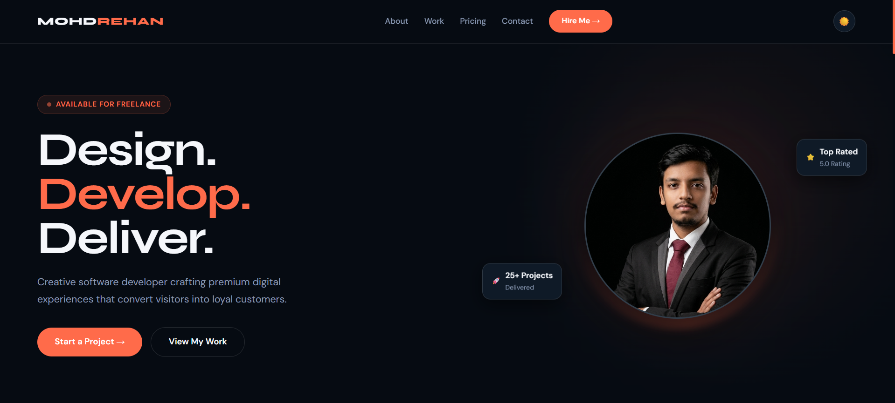

<div align="center">

  

  <h1>Mohd Rehan — Creative Developer Portfolio</h1>

  <p>A sleek, fully responsive personal portfolio built with pure HTML, CSS & JavaScript.</p>

  
  
  
  

  
  
  

  **[🌐 Live Demo](#)** &nbsp;·&nbsp; **[📬 Contact](mailto:yourmail@gmail.com)** &nbsp;·&nbsp; **[💼 LinkedIn](https://www.linkedin.com/in/mohdrehxn/)**

</div>

---

## 📸 Preview

> 

---

## ✨ Features

- 🌗 **Dark / Light theme** — toggle with one click, persists via `localStorage`
- 📱 **Fully responsive** — mobile-first layout with a smooth hamburger menu
- 🎞️ **Scroll-reveal animations** — powered by `IntersectionObserver`, zero JS libraries
- 💱 **Currency switcher** — flips pricing between ₹ INR and $ USD instantly
- ✅ **Form validation** — inline client-side error messages on the contact form
- 🖼️ **Avatar fallback** — shows initials if profile photo fails to load
- 🔗 **Active nav tracking** — highlights the current section as you scroll
- ⚡ **Zero dependencies** — no npm, no build step, just open and go

---

## 🗂️ Project Structure

```
portfolio/
├── index.html        # Everything — markup, styles & scripts in one file
└── images/
    └── profile.png   # Hero profile photo (replace with your own)
```

---

## 🚀 Getting Started

### Run locally

No installs needed — just open the file:

```bash
# Clone the repo
git clone https://github.com/mohdrehxn/portfolio.git
cd portfolio

# Open directly
open index.html          # macOS
start index.html         # Windows
xdg-open index.html      # Linux
```

Or spin up a local server:

```bash
npx serve .
# or
python -m http.server 8000
```

---

## 🌍 Deploy

| Platform | Steps |
|----------|-------|
| **GitHub Pages** | Settings → Pages → Source: `main` branch, root `/` |
| **Netlify** | Drag & drop the folder on [netlify.com/drop](https://netlify.com/drop) |
| **Vercel** | `vercel` CLI or import repo at [vercel.com/new](https://vercel.com/new) |

---

## 🎨 Customisation

### Change accent colour

All colours live as CSS variables at the top of `index.html`:

```css
[data-theme="dark"] {
    --accent:  #ff6b4a;  /* primary accent */
    --accent2: #ff9473;  /* hover states   */
}
```

### Add a project card

Copy this snippet inside `.projects-grid` and fill in your details:

```html
<div class="project-card proj-3 reveal delay-3">
    <div class="bg"></div>
    <div class="proj-emoji" aria-hidden="true">🌐</div>
    <div class="overlay">
        <span class="project-tag">Your Category</span>
        <h3>Project Title</h3>
        <p class="project-desc">Short description.</p>
        <a href="https://your-url.com" class="project-link">View Project →</a>
    </div>
</div>
```

### Enable the contact form

The form ships with client-side validation only. To actually send emails, connect a free service:

| Service | How |
|---------|-----|
| [Formspree](https://formspree.io) | Replace the `fetch` URL with your Formspree endpoint |
| [EmailJS](https://www.emailjs.com) | Call `emailjs.send()` inside the submit handler |
| [Web3Forms](https://web3forms.com) | POST to their API with your access key |

### Update personal details

Search for these placeholders in `index.html` and swap in your own:

```html
<a href="mailto:yourmail@gmail.com">yourmail@gmail.com</a>
<a href="tel:+917893250037">+91 7893250037</a>
<a href="https://www.linkedin.com/in/mohdrehxn/">LinkedIn Profile</a>
```

---

## 📄 License

This project is for personal/portfolio use. You're welcome to adapt it for your own portfolio — credit appreciated but not required.

---

<div align="center">
  <p>Crafted with ❤️ by <a href="https://www.linkedin.com/in/mohdrehxn/"><strong>Mohd Rehan</strong></a></p>
  <p>⭐ Star this repo if you found it helpful!</p>
</div># portfolio
